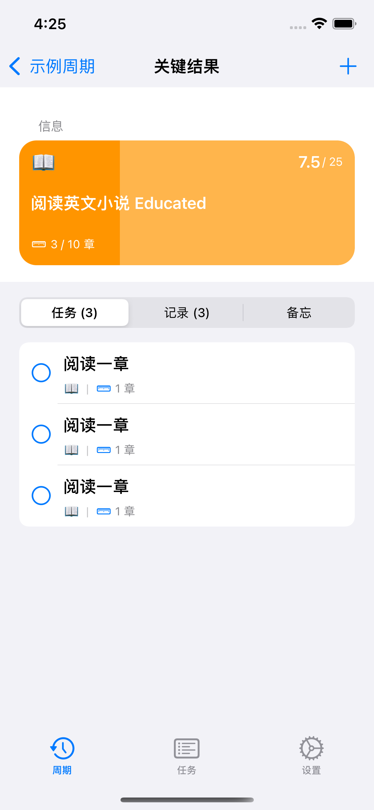
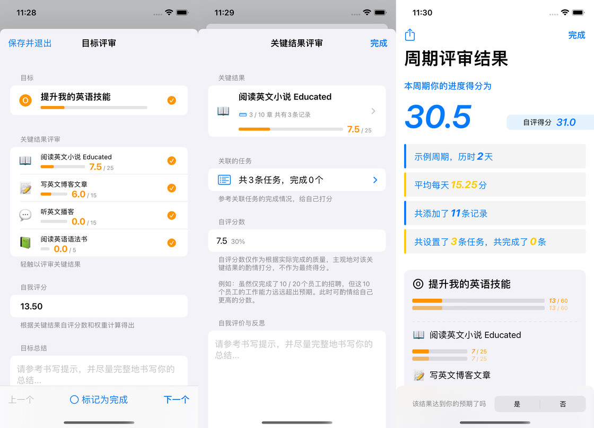
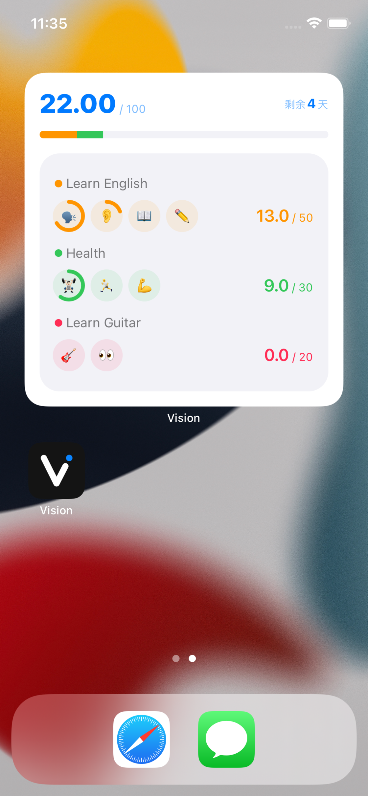

# Vision 第三个里程碑

很高兴地向大家宣布，Vision 达到了我们第三个里程碑 —— 上线付费版本。

## 回顾

还完全不了解 Vision 的朋友，可以先看我们之前发布的两篇文章（*给出前面两篇文章的链接）*以及我们的官方博客。

在这两个月时间里，我们逐步实现之前呼声很高的 iCloud 同步、macOS 的支持，更多的桌面小组件。更重要的是，我们继续紧紧围绕着 OKR 方法论，推出了两个重量级的产品功能：**任务**和**周期评审**。

### 任务

我们在 2.2 上线了任务功能。在任务之前，我们要记录我们关键结果的完成情况，只能通过*事后*添加记录的方式。而现在，我们可以通过创建任务，并关联关键结果的数量，可以轻松地在*事前*计划你要如何去完成你的关键结果。如下图：

我们可以轻松地在关键结果详情页创建关联该关键结果的任务。每当完成一项任务时，它会自动向你的关键结果添加一条记录。

不同于目标和关键结果、目标需要你通过认真的思考和编辑，任务是灵活的，你可以在周期内任何时间创建和完成。你可以每周创建一批任务，也可以每天。通过周期、目标的任务列表，你可以很清晰地获取到你当前需要完成的任务。

但需要指出的是，Vision 的任务功能仅仅是 OKR 方法论实践的辅助功能，我们在设计任务功能的时候，会优先考虑如何与 OKR 本身相结合。它可能与市面上的其他专门的 todo 类 app 有一些明显的区别。

### 周期评审

周期评审一定是一个 OKR 方法论里重中之重的环节。

《论语》中的，子曰：“温故而知新，可以为师矣。”只有在周期结束时，认真总结并反省执行过程中的长处和短板，才更可能在以后的周期中进步。

在 2.3 版本的周期评审中，我们主要围绕着用户实际的进度得分，通过制定的任务的完成情况，给自己的每个关键结果书写评价总结，并给出一个*自我评分*。

这里要解释一下自我评分。在 OKR 结束后，虽然我们可以得到一个*相对客观的*进度得分 —— 即通过创建周期时给各个关键结果的权重、实际完成的数量算出。但周期执行时会出现很多复杂且难以预料的情况，使得我们在创建周期时给出的量化关键结果的方式并不能精准地衡量我们是否达到了对应的目标。

譬如这个例子：

目标：完成这个项目
关键结果：招聘 5 名工程师

然而在周期结束时，我们只招到了 3 名工程师，但由于工程师的水平高得出乎意料，也让我们顺利完成了这个项目。针对这种情况，我们在周期评审中，一方面要学习到“我们还可以招水平更高的工程师来完成这个项目”的经验，并获得一个差强人意的进度得分（3/5），另一方面，也可以通过自我评分，根据实际对目标做出的贡献，偏向于*完成的质量*而不是*数量*，给自己一个酌情的高分，比如 4/5 分。

随着时间的推进，我们对事物的认知，一定是逐步增加的，以至于我们在做计划时（制定 OKR 周期时），并不能完全预知到所有的实际情况。这时原本的*只针对数量*评价机制就变得不再具有参考价值。但是，当这种情况发生时，我们也不能完全舍弃原本的评价机制，我们应该从中吸取到经验教训，而去反思：“我们为什么不能预先知道还可以招聘水平更高的工程师呢？”

在书写目标和关键结果的总结时，我们会从*制定*和*执行*两方面来总结。即

- 制定得是否具有挑战性，是否对目标的实现做了贡献的相关性，权重是否分配恰当
- 执行时遇到和解决的困难

我们在 app 的相关界面上都给出了书写提示，给大家提供参考。

### 首要周期

之前有很多用户认为需要在同一时间存在多个周期，以规划他们不同类型的目标。其实这种用法在 OKR 中是不推荐的。作为现阶段的 Vision，仅仅用于规划*个人*的 OKR，不存在多人协作的情况。因此一个人在不存在分身术的情况下，在同一时间，只可能存在一个周期的目标。因此，我们在 Vision 中引入了*首要周期*的概念，以强调 OKR 的推荐用法。而主屏幕的小组件也是仅仅显示首要周期的情况。

### 主屏幕小组件

在 2.3 中我们尝试推出了第一款大号小组件。小组件不仅可以直观快捷获取当前的周期执行的状态，也是我们少数提供比较活泼、个性化装饰的功能。我们会在设计小组件时偏向于更加灵活和个性化，希望大家能喜欢。

## 未来的计划

目前版本的 Vision，可以说实现了我们想要做的核心功能的 MVP (最小可行性产品)。我们深知未来的路还非常长。根据现实情况，我们列出了以下几个我们会在近期做的工作，并按照我们自己的优先级来逐步推出。

### 优先实现和优化 OKR 相关的功能

首先，Vision 的根基一定是 OKR。我们认可 OKR，相信它给我们能带来不一样的价值。然而我们的用户可能一开始并不熟悉 OKR 的实践，把 Vision 按照他们更加熟悉的方式来使用，比如有些用户把 Vision 完全当成习惯打卡来使用；希望同时存在多个周期。对于这些“不推荐”的用法，我们会逐渐推出我们的“推荐”用法的功能，类似于首要周期。

#### 中期评审

我们一直强调，OKR 的制定过程一定是一个仔细思考和论证的过程，它需要时间和精力去思考 —— 越是经过仔细思考和论证的目标，越有动力和可能性去实现。类似地，编辑周期也是这样。在各类 OKR 的书中会提到需要通过开周例会、月例会去对 OKR 进行修改以适应当前“计划赶不上变化”的现实情况。在 Vision 中，我们会推出**中期评审**的功能，来实现符合 OKR 方法论的“编辑周期”。我们需要在中期评审中，简单地记录修改目标或关键结果的理由，以便我们在周期评审的环节中做更加详细的总结。

#### 关键结果数量的优化

我们在之前的版本根据数量，区分出了“度量型”和“里程碑型”关键结果。但我们还在实践中发现，我们有时候需要记录度量型关键结果的起始值和目标值。例如“从 75 公斤减重到 60 公斤”；继续使用这个例子，我们还存在减重到 70 公斤时，又反弹了 2 公斤，是否需要反映到我们的记录列表中，是我们后面需要调研的方向。

### 优化任务功能

一旦将周期制定好以后，用户大多数用到的功能一定是任务。如前文介绍，我们现在的很多功能处于 MVP 阶段。而优化用户高频使用的任务功能，一定是我们接下来工作方向的重中之重。预计我们会在着重优化以下几点：

- 创建任务的体验
- 任务的截止时间和提醒
- 任务列表的排序
- 创建重复任务
- 批量创建任务
- 日历视图、统计图表、完成时间统计等等

然而，如前文所述，我们并不打算把任务功能做得像市面上其他专门的 todo app 一样大而全。

### 推出更多教程、示例周期

之前我们在用户群内做了调查问卷，显示大多数用户希望我们能推出更多的教程和示例周期。同时我们也发现，我们有相当一部分用户属于同一种使用场景，如备考。有时也会发现用户发给我们他们制定的 OKR 有一些使用上的问题（特别指出：这里是用户主动发给我们看的，我们并没有后台来收集用户使用数据，绝对保护用户的隐私）。针对这些情况，我们会陆续推出我们详细的教程，以及针对常见场景的示例周期。

## 关于专业版和定价

经过多次利弊的权衡，我们认为 2.3 版本是我们上线专业版成熟的时机。

像 App Store 生态中诸多独立开发者一样，我们因为热爱、乐于将自己的想法创造成产品从而帮助到更多的用户，我们开始用爱发电。但现实情况使得这样做并不能让我们持续下去。如果你认为 Vision 能为你带来价值，请希望多多支持我们。而暂时无法购买专业版的用户，我们也提供了足够的免费功能供大家试用，以及年费并提供 2 周的免费试用时长。

我们也会陆续在用户群中推出赠送专业版兑换码的活动，请想要使用专业版而暂时无法付费的用户积极参与我们的活动。通过 Vision 应用内提供的微信群二维码，或添加 VisionOKR 为微信好友，我们会长期不定时在群里以不同形式举行赠送年费、月费兑换码的活动，欢迎大家踊跃加群。

## 总结

如我们多次强调，Vision 想要做一个硬核的、严肃的、有自己想法的基于 OKR 方法论打造的目标管理工具。我们会继续坚持在 UI 上简洁易用，尽可能继承 iOS 常见的交互逻辑，（现阶段）积极适配并扎根于 Apple 平台特性。

Vision 的下载链接：https://apps.apple.com/app/id1572457968
微信：VisionOKR
邮箱：grepug@icloud.com
